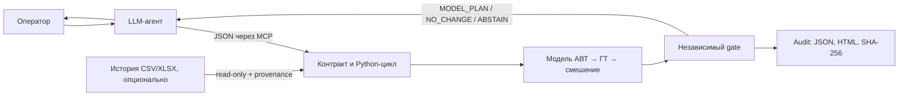

# Конкурсный контур Neftecode

Цель репозитория — показать архитектуру агента-помощника оператора для цепочки
АВТ → гидроочистка → смешение. Агент принимает контекст и задачу, вызывает
строго ограниченный расчётный инструмент и объясняет рекомендацию или отказ.
Реальные журналы исполнения команд не нужны для запуска и оценки этой
архитектуры.



## Пятиминутная демонстрация

Требуется Python 3.12. Производственные файлы, API-ключ и подключение к сети
не нужны.

```bash
python3 -m venv .venv
source .venv/bin/activate
python -m pip install -r requirements-agent.txt
python scripts/run_competition_demo.py --output output/competition-demo
```

Откройте `output/competition-demo/report.html`. Прогон запускает настоящий
локальный MCP-сервер и клиент, получает контракт и проверяет:

- рекомендацию с планом P8/T11/F19, выпуском, смешением и стоимостью;
- сохранение режима через `NO_CHANGE`;
- отказ, когда исходный заказ не проходит полный набор допущений;
- отказ при недоступных данных;
- невозможность ослабить обязательный предел серы `≤10 мг/кг`;
- отбрасывание лишних аргументов и неизвестного инструмента;
- совпадение каждого ответа MCP с прямым Python API и SHA-256 аудита.

Для показа поведения LLM поверх того же MCP-инструмента можно отдельно
запустить `python scripts/run_agent_demo.py --output output/real-agent`.
Этот шаг использует установленный Codex CLI и его текущую авторизацию, поэтому
он не входит в обязательный офлайн-маршрут.

## Демонстрация с историческими данными

Если на машине показа доступны HT CSV и ЛИМС XLSX, установите
`requirements-historical.txt` и запустите:

```bash
python scripts/agent_connection.py --data-root /path/to/archive --launch
```

Готовый hash-pinned bundle добавит агенту
прогноз серы 15–180 минут, диапазон неопределённости и исторически типичный
режим. Пять аналогов добавляются после локальной пересборки full bundle по
[инструкции](HISTORICAL_INTELLIGENCE.md). Эталонный набор из 13 случаев запускается через
`scripts/run_agent_benchmark_v2.py`.

Проверенный holdout 2024Q4 показал улучшение MAE серы на 15,8–28,2% против
последней допустимой пробы на всех пяти горизонтах. Для controls общий gate
отклонён: улучшился F19, а P8/T11 остались на `NO_CHANGE`. Эта граница видна
агенту и не скрывается конкурсной подачей.

## Что находится внутри

| Слой | Ответственность |
|---|---|
| LLM-агент | Получить контракт, собрать известные входы, вызвать инструмент и объяснить результат |
| MCP boundary | Разрешить только чтение контракта и расчёт; запретить пути, shell, смену модели и лимита |
| Python decision cycle | Рассчитать сценарий на горизонте 0–3 ч и сформировать кандидатов |
| Независимый gate | Проверить качество, запасы, исходный заказ, серу ≤10 мг/кг и допустимость результата |
| Temporal/provenance layer | Разделить время события и доступность; не раскрывать неизвестный ЛИМС/ПАК онлайн |
| Historical intelligence | Прогнозировать качество, показывать диапазон и аналоги без подмены оптимизатора |
| Audit layer | Сохранить запрос, ответ, trace ролей, карточку оператора, версии и хеши |

Исторический адаптер подключается только для read-only контекста. Неизвестные
входы модели остаются явными сценарными допущениями. Timestamp ЛИМС трактуется
как время пробы; публикация и доступность — отдельные сведения. ПАК исключён,
пока не установлены смысл timestamp, задержка и статусы исправности.

## Граница результата

Конкурсный результат — проверяемая архитектура советующего агента. Она не
записывает уставки в АСУ ТП и не объявляет модельный эффект подтверждённым на
производстве. Модули сбора `issued_time`/`executed_time`, связывания с пробами
и holdout уже есть в репозитории как путь будущей промышленной валидации, но
не являются зависимостью конкурсного демо.
